# Sterling: An Introduction for Newcomers

**Author**: @darianrosebrook
**Created**: December 1, 2025
**Last Updated**: January 24, 2026
**Status**: Living Document

> **Note**: This document references canonical definitions in `docs/canonical/`. Core Constraints v1, the Neural Usage Contract, and Evaluation Gates are maintained as single-source artifacts to prevent documentation drift.

---

## Table of Contents

1. [What is Sterling?](#what-is-sterling)
2. [What is Sterling For?](#what-is-sterling-for)
3. [What Makes Sterling Different?](#what-makes-sterling-different)
4. [How Sterling Works](#how-sterling-works)
5. [Learning Path](#learning-path)
6. [Key Concepts Deep Dive](#key-concepts-deep-dive)
7. [Architecture Overview](#architecture-overview)
8. [Current Status](#current-status)

---

## What is Sterling?

**Sterling** is a **neurosymbolic reasoning engine** that combines explicit symbolic structures with small neural models to perform domain-agnostic reasoning tasks.

### The Core Thesis

> How much of "intelligence" can we get if we:
>
> - Make semantics explicit (structured IR instead of free-form text)
> - Move facts into a knowledge graph (not transformer weights)
> - Encode linguistic rules directly (not learned patterns)
> - Let small neural models handle only compression + surface form?

**Sterling's answer**: You can outperform frontier LLMs on reasoning tasks while using orders of magnitude less compute, with full auditability.

### Evidence (as of v1.3.1)

> **Eligibility note**: All numbers in this section are v1 measurements. They are not backed by v2 benchmarking policy artifact bundles and are not eligible for published claims until reproduced under v2 CERTIFIED mode. See [`docs/policy/benchmarking_policy.md`](../../policy/benchmarking_policy.md).

#### Benchmark Results (v9.5 Audit)

| Benchmark            | Status  | Key Metrics                                       |
| -------------------- | ------- | ------------------------------------------------- |
| **WORDNET**          | ✅ PASS | operator: 100%, top3: 100%, value_corr: 97.3%     |
| **DIALOGUE_MODEL**   | ✅ PASS | value_pairwise: 92.07%, operators: 100% (4/5)     |
| **DIALOGUE_RULES**   | ✅ PASS | intent_family: 78.8%, phase: 72.1%                |
| **DISCOURSE**        | ✅ PASS | coref_f1: 96.4%, topic: 70.4%                     |
| **CODE_REFACTORING** | ✅ PASS | operator: 100%, refactor: 100%, value_corr: 99.9% |
| **CROSS_DOMAIN**     | ✅ PASS | zero_shot: 84.0%, transfer: 84.7%                 |

**Overall**: 6/6 benchmarks passing ✅

#### Performance Metrics (K6.2 Optimizations)

**Massive Performance Improvements**:
- **Per-Expansion Time**: 30-40s → ~1ms (**30,000-40,000× faster**)
- **Per-Case Time**: 33-45s → ~0.43s (**75-100× faster**)
- **50-Case Runtime**: ~85 minutes → ~5.3 minutes (**16× faster**)
- **Total Execution**: 31.9s → 24.3s (with caching: **67% faster scenario generation**)

**Optimization Impact**:
- **Operator Filtering**: 83% fewer operators attempted (5-6 → 1-2 per expansion)
- **KG Query Reduction**: 7 queries → ~2 queries per expansion (when filtered)
- **Memory Usage**: 1,588 MB → 1,117 MB (**30% reduction**)
- **Linear Scaling**: Confirmed across 5-100 case test suites

**Test Suite**: 1,360 passed, 0 failed (96.5% pass rate)
**Compute Efficiency**: 29-600× faster than GPT-4/Claude on equivalent tasks

#### Operator Induction Proof (K6)

**Controlled A/B/C Experiment**:
- **Config A (Baseline)**: 0% success rate (production operators fail)
- **Config B (Shadow)**: 0% success rate (shadow influence provides no capability)
- **Config C (Promoted)**: 100% success rate (certified induced operator enables solution)

**Conclusion**: End-to-end induction → certification → promotion pipeline causes measurable capability lift on scenarios unsolvable by production operators.

#### Efficiency Evidence (K6.2+)

**Work Rate Metrics**:
- **Expansions per Second**: ~1,000 expansions/sec (from ~0.03/sec before)
- **Apply Success Rate**: High (only allowed operators attempted)
- **Prune Rate**: Minimal (invariants working efficiently)
- **Governance Overhead**: <5% of total time (deepcopy, hash, invariant checks)

**Key Optimizations**:
- **Three-Layer Filter Enforcement**: Prevents disallowed operators from reaching expensive apply phase
- **Typed Edge Index**: O(1) lookups instead of O(deg(v)) scans
- **KG Caching**: Eliminates redundant KG loading (67% faster scenario generation)
- **Case Pool Caching**: Near-instant scenario generation on subsequent runs

#### Governance Audits

- **WordNet Navigation**: 100% success on 15-16 hop chains, 29-600× faster than GPT-4/Claude
- **PN Verification**: Perfect generalization across 8 linguistic families
- **Rush Hour Puzzles**: 32% fewer nodes explored than BFS
- **Compute**: ~132ms average vs LLM timeouts on equivalent tasks
- **Learning Signal Audit**: 7 signal categories identified, all consumable by refinement/induction
- **Oracle Separation**: ✅ PASSED - No label leakage detected (ablation delta: -0.85%)
- **No Hidden Routers**: ✅ PASSED - All routing decisions auditable via TraceAuditor
- **Value Target Contract**: ✅ PASSED - Canonical targets versioned and hash-verified

### Three Layers

Sterling is organized into four layers, each replacing a different function that current AI systems delegate to transformers. See [Sterling Architecture Layers](../../reference/canonical/sterling_architecture_layers.md) for the full definition.

| Layer | What It Replaces | What Sterling Uses Instead |
|-------|-----------------|---------------------------|
| **L0: Reasoning** | Transformer chain-of-thought | Governed search over typed state with deterministic replay |
| **L1: Memory** | KV cache / context window | Semantic Working Memory with Committed/Shadow/Weak lifecycle |
| **L2: Carrier** | Python objects + JSON serialization | Code32/ByteState byte tensors ([spec](../../reference/canonical/code32_bytestate.md)) |
| **L3: Realization** | Autoregressive token prediction | IR-conditioned diffusion (experimental) |

**Current Status**: L0 operational (v1.3.1, cert-grade domains). L1 implemented (SWM passing all gates). L2 specified (pre-implementation). L3 experimental.

### Why "Sterling"?

**Sterling** is an acronym for:

**S**emantic **T**ree **E**mbedding & **R**easoning for **L**inguistic **I**nterpretative **N**euro-Symbolic **G**raphs

The name also evokes "sterling quality" — reflecting the project's commitment to high-quality, auditable reasoning. The acronym emphasizes the core architectural elements:

- **Semantic Tree**: Structured IR representation (not free-form text)
- **Embedding**: Latent compression for efficient similarity search
- **Reasoning**: Graph-based inference with operator calculus
- **Linguistic Interpretation**: Domain-agnostic but proven on linguistic tasks
- **Neuro-Symbolic**: Small neural models for compression and surface form
- **Graphs**: Knowledge graphs as the reasoning substrate

---

## What is Sterling For?

Sterling is designed for **reasoning tasks** where you need:

1. **Auditable reasoning**: Every conclusion must have a proof trace
2. **Domain flexibility**: Same engine works across linguistics, code, specs
3. **Efficiency**: Fast inference with small models
4. **No hallucination**: All facts come from KG or explicit operators

### Use Cases

#### Current (L0 + L1)

- **Linguistic Analysis**: Verify predicate nominal constructions, explain grammatical structures
- **Knowledge Graph Navigation**: Find paths between concepts (e.g., WordNet taxonomy traversal)
- **Transformation Tasks**: Canonicalize sentences, flip truth values, invert identity statements
- **Agent Reasoning Backend**: A2A integration with external orchestrators (Agent Agency V4)

#### Planned (L2 + L3)

- **ByteStateV1 substrate**: Hardware-native packed state tensors for batch frontier operations
- **ByteTraceV1 evidence**: Byte-for-byte replayable trace bundles for governance certification
- **Semantic realization**: IR-conditioned diffusion for fluent, semantically faithful text output
- **Domain induction**: Automatic domain creation from traces via governed artifact promotion

### What Sterling is NOT For

- **General conversation**: Not a chatbot (though could be a component)
- **Creative writing**: Not designed for open-ended generation
- **Large-scale fact retrieval**: KG is small (300-500 nodes), not Wikipedia-scale
- **Real-time streaming**: Designed for bounded reasoning episodes

---

## What Makes Sterling Different?

<!-- BEGIN CANONICAL: north_star -->
**Sterling is NOT a language model.** Sterling is a **path-finding system over semantic state space**, where:

| Concept | Definition |
|---------|------------|
| **Nodes** | Meaningful states (UtteranceState, WorldState, summaries/landmarks) |
| **Edges** | Typed moves (operators) |
| **Learning** | Path-level credit assignment (what edges help from what regions) |
| **Memory** | Compression-gated landmarks + durable provenance |
| **Language** | I/O, not cognition (IR intake + explanation only) |

Sterling explicitly tries to **replace LLMs as the reasoning substrate** (the cognitive core / long-horizon state machine). Sterling does NOT try to replace LLMs at **language generation** (surface form production).

See [docs/canonical/north_star.md](../canonical/north_star.md) for the full operational definition.
<!-- END CANONICAL: north_star -->

### Comparison with Standard Approaches

Sterling occupies a similar "idea neighborhood" as Graph-RAG, memory systems, and world models, but makes fundamentally different architectural commitments:

| Standard LLM + Graph-RAG                     | Sterling                                                  |
| -------------------------------------------- | --------------------------------------------------------- |
| Transformer is the cognitive core            | Transformer is a replaceable codec                        |
| Node-level importance scores                 | Edge-relative plasticity + path algebra                   |
| Text-blob summaries in a database            | Summary nodes as first-class KG objects                   |
| Free-form chain-of-thought in reasoning loop | No CoT in decision loop; all state in IR+KG               |
| Memory = logs + summaries                    | Memory = compression-gated decay + episodic consolidation |
| Graph is an "address book" for retrieval     | Graph is the reasoning substrate                          |
| Semantics live in transformer weights        | Semantics live in IR + KG structure                       |

For a deeper discussion, see [docs/internal/notes/not_graph_rag.md](../internal/notes/not_graph_rag.md).

### Core Constraints v1

<!-- BEGIN CANONICAL: core_constraints_v1 -->
Sterling enforces 11 architectural invariants that block merge/deploy if violated:

| ID | Constraint | Description |
|----|------------|-------------|
| INV-CORE-01 | No Free-Form CoT | No generative LLM chain-of-thought in the decision loop |
| INV-CORE-02 | Explicit State | All task state in UtteranceState + KG, not transformer KV cache |
| INV-CORE-03 | Structural Memory | Episode summaries + path algebra for long-horizon, not transcript prompts |
| INV-CORE-04 | No Phrase Routing | No phrase dictionary or regex-based routing; all routing via scored search |
| INV-CORE-05 | Computed Bridges | Cross-domain bridges computed at runtime, not static lookup tables |
| INV-CORE-06 | Contract Signatures | Landmark/operator signatures are typed contracts, not learned embeddings |
| INV-CORE-07 | Explicit Bridge Costs | Domain transitions carry explicit costs with hysteresis |
| INV-CORE-08 | No Hidden Routers | All routing decisions auditable via StateGraph; no secret bypasses |
| INV-CORE-09 | Oracle Separation | No future/oracle knowledge in inference inputs; only in training signals |
| INV-CORE-10 | Value Target Contract | Canonical value targets versioned and hash-verified |
| INV-CORE-11 | Sealed External Interface | External tools cannot mutate internal state except via governed operators with declared write-sets |

See [docs/canonical/core_constraints_v1.md](../canonical/core_constraints_v1.md) for full details.
<!-- END CANONICAL: core_constraints_v1 -->

### Governance Modes

Sterling distinguishes three orthogonal governance concepts (see [Governance Deep Dive](study_materials/10_governance_and_lifecycle_deep_dive.md) for details):

| Flag | Purpose | Key Check |
|------|---------|-----------|
| **Invariant Strictness** | State layer integrity | `set_strict_invariants(True)` raises on I1/I2/I4/I5 violations |
| **Run Intent** | Semantic validation rigor | `RunIntent.CERTIFYING` makes warnings into errors |
| **Promotion Strictness** | Certification gates | Fail-closed: `artifact_store` required for strict promotion |

**Quick Reference**:
```python
from core.governance.run_intent import RunIntent

intent = RunIntent.CERTIFYING
if intent.is_strict:  # True for CERTIFYING, PROMOTION, REPLAY
    # Apply strict validation, fail-closed behavior
    pass
```

### Neural Usage Contract

**Core Principle: Neural is advisory; Symbolic is authoritative.**

Neural components may rank or prioritize **already-legal** symbolic moves (hybrid value function), but they cannot create new operators, bypass operator preconditions, mutate KG/UtteranceState directly, introduce new facts, or override symbolic logic.

See [docs/canonical/neural_usage_contract.md](../canonical/neural_usage_contract.md) for the full contract.

---

## How Sterling Works

### High-Level Flow


### Core Components

#### 1. UtteranceState (Five Layers)

Every sentence/utterance is represented as a layered structure:


**Invariant**: Syntax is the only layer encoding phrase structure. Semantics is typed graph structures. Latents are summaries, never source of truth.

#### 2. Operators (S/M/P/K/C Taxonomy)

All state changes happen through typed operators:

| Category | Name       | Scope     | Reads                  | Writes                |
| -------- | ---------- | --------- | ---------------------- | --------------------- |
| **S**    | Structural | Utterance | syntax                 | syntax                |
| **M**    | Meaning    | Utterance | semantics, semiotics   | semantics             |
| **P**    | Pragmatic  | Discourse | semantics, pragmatics  | pragmatics, semantics |
| **K**    | Knowledge  | World     | semantics, world_state | world_state           |
| **C**    | Control    | Search    | state_graph            | state_graph           |

**Example**: `APPLY_NEGATION` is an M-operator that reads semantics, writes semantics, and flips polarity.

#### 3. StateGraph (Reasoning Episode)

The StateGraph is a **first-class audit trail** of a reasoning episode:

- **Nodes**: Search states (positions in the search graph)
- **Edges**: Operator applications with full metadata
- **Root**: Initial state
- **Goal nodes**: Terminal states satisfying goal criteria
- **Dead ends**: Pruned branches

Every piece of information used in scoring is reconstructible from the StateGraph.

#### 4. Value Function (Multi-Factor Scoring)

Sterling uses a hybrid value function to guide search:

```
Score(s) = w_struct * V_structural(s)
         + w_latent * V_latent(s)
         + w_memory * V_memory(s)
         + w_task   * V_task(s)
```

- **V_structural**: Learned TransitionScorer over structural features (8/9/12-dim)
- **V_latent**: Novelty from latent similarity (optional)
- **V_memory**: SWM decay signals (penalize revisiting pruned branches)
- **V_task**: Task-specific rewards (e.g., penalize high operator count)

**Key insight**: The same structural features work across domains (WordNet, IR graphs, Rush Hour).

#### 5. Semantic Working Memory (SWM)

SWM is a **bounded active subgraph** used for reasoning:

- **Constraints**: max_nodes, max_edges, max_depth
- **Selection**: Task-specific policies (edge biases, operator whitelists)
- **Decay**: Usage-based memory management (SUCCESS_PATH, EXPLORED, NEGATIVE_EVIDENCE)

This prevents the system from operating on the entire KG at once.

---

## Learning Path

### For AI Researchers

**Goal**: Understand the research contributions and experimental validation.

#### Week 1: Theory Foundation

1. **Read**: [`docs/archive/roadmaps/core_roadmap.md`](../archive/roadmaps/core_roadmap.md) - Understand the theoretical framework (reference doc)
2. **Read**: [`docs/GLOSSARY.md`](../GLOSSARY.md) - Learn canonical terminology
3. **Read**: [`docs/architecture/quick_reference.md`](../architecture/quick_reference.md) - Understand architectural commitments

**Key Questions to Answer**:

- What is UtteranceState and why five layers?
- What are S/M/P/K/C operators and why this taxonomy?
- How does StateGraph differ from standard search trees?

#### Week 2: Implementation Deep Dive

1. **Read**: [`core/state_model.py`](../../core/state_model.py) - State hierarchy implementation
2. **Read**: [`core/reasoning/state_graph.py`](../../core/reasoning/state_graph.py) - StateGraph implementation
3. **Read**: [`core/reasoning/loop.py`](../../core/reasoning/loop.py) - Reasoning loop (focus on `reason()` method)
4. **Read**: [`core/operators/registry.py`](../../core/operators/registry.py) - Operator calculus

**Key Questions to Answer**:

- How are layer invariants enforced?
- How does operator contract validation work?
- How does the value function integrate with search?

#### Week 3: Experiments and Benchmarks

1. **Read**: [`benchmarks/wordnet_navigation_v1/README.md`](../../benchmarks/wordnet_navigation_v1/README.md) - WordNet benchmark results
2. **Read**: [`experiments/latent/results/`](../../experiments/latent/results/) - Latent compression experiments
3. **Run**: [`scripts/run_wordnet_experiment.py`](../../experiments/run_wordnet_experiment.py) - Generate your own episodes

**Key Questions to Answer**:

- How does Sterling compare to LLM baselines?
- What is the evidence for cross-domain generalization?
- What are the current limitations?

#### Week 4: Extend and Experiment

1. **Implement**: A new operator (e.g., `RESOLVE_COREFERENCE`)
2. **Implement**: A new task (e.g., `entailment_check`)
3. **Experiment**: Train a value head on a new domain

**Key Questions to Answer**:

- Can you add a new world adapter?
- Can you extend the operator taxonomy?
- What happens if you change the value function weights?

### For Technical Leads

**Goal**: Understand the architecture, design decisions, and how to extend the system.

#### Day 1: Architecture Overview

1. **Read**: [`README.md`](README.md) - High-level overview
2. **Read**: [`docs/architecture/quick_reference.md`](../architecture/quick_reference.md) - Architecture summary
3. **Read**: [`docs/archive/roadmaps/core_roadmap.md`](../archive/roadmaps/core_roadmap.md) - Architecture reference
4. **Read**: [`docs/roadmaps/core_realignment_2026_consolidated_closeout.md`](../roadmaps/core_realignment_2026_consolidated_closeout.md) - Active work tracking

**Key Questions to Answer**:

- What are the architectural commitments and why?
- How does Sterling differ from standard LLM + RAG?
- What is the current implementation status? (See consolidated closeout)

#### Day 2: Core Components

1. **Read**: [`core/engine.py`](../../core/engine.py) - Main entrypoint
2. **Read**: [`core/reasoning/loop.py`](../../core/reasoning/loop.py) - Reasoning loop
3. **Read**: [`core/worlds/base.py`](../../core/worlds/base.py) - World adapter interface
4. **Read**: [`core/value/hybrid.py`](../../core/value/hybrid.py) - Value function

**Key Questions to Answer**:

- How does task dispatch work?
- How do world adapters plug in?
- How is the value function composed?

#### Day 3: Extension Points

1. **Read**: [`core/worlds/pn.py`](../../core/worlds/pn.py) - Example world adapter
2. **Read**: [`core/tasks/pn_verification.py`](../../core/tasks/pn_verification.py) - Example task
3. **Read**: [`kg/swm_policy.py`](../../kg/swm_policy.py) - SWM policy configuration

**Key Questions to Answer**:

- How do you add a new world?
- How do you add a new task?
- How do you configure SWM policies?

#### Day 4: Testing and Quality

1. **Read**: [`tests/unit/test_state_model.py`](../../tests/unit/test_state_model.py) - State model tests
2. **Read**: [`tests/integration/test_sterling_engine.py`](../../tests/integration/test_sterling_engine.py) - Integration tests
3. **Run**: `python -m pytest tests/ -v` - Execute test suite

**Key Questions to Answer**:

- What is the test coverage?
- How are invariants tested?
- What are the quality gates?

### For AGI Auditors

**Goal**: Understand safety properties, auditability guarantees, and failure modes.

#### Session 1: Safety Architecture

1. **Read**: [`docs/GLOSSARY.md`](../GLOSSARY.md) - Terminology (focus on "Non-Hallucinatory Reasoning")
2. **Read**: [`core/reasoning/state_graph.py`](../../core/reasoning/state_graph.py) - Audit trail structure
3. **Read**: [`core/operators/registry.py`](../../core/operators/registry.py) - Operator contracts

**Key Questions to Answer**:

- How does Sterling prevent hallucination?
- What is the proof trace structure?
- How are operator contracts enforced?

#### Session 2: Auditability Mechanisms

1. **Read**: [`core/reasoning/episode_logger.py`](../../core/reasoning/episode_logger.py) - Episode logging
2. **Read**: [`core/reasoning/state_graph.py::get_path_to_goal()`](../../core/reasoning/state_graph.py) - Path reconstruction
3. **Read**: [`scripts/check_episode_v2_integrity.py`](../../scripts/utils/check_episode_v2_integrity.py) - Integrity checking

**Key Questions to Answer**:

- How can you reconstruct a reasoning episode?
- What information is logged?
- How do you verify episode integrity?

#### Session 3: Failure Modes and Limitations

1. **Read**: [`docs/internal/risks_full_model.md`](../internal/risks/risks_full_model.md) - Risk assessment
2. **Read**: [`docs/internal/risks_toy_model.md`](../internal/risks/risks_toy_model.md) - Toy model risks
3. **Read**: [`experiments/latent/results/`](../../experiments/latent/results/) - Known limitations

**Key Questions to Answer**:

- What are the known failure modes?
- What are the current limitations?
- What safety properties are guaranteed vs. best-effort?

#### Session 4: Verification and Testing

1. **Read**: [`tests/unit/test_operator_registry_shadow.py`](../../tests/unit/test_operator_registry_shadow.py) - Operator contract tests
2. **Read**: [`tests/unit/test_stage_a_hardening.py`](../../tests/unit/test_stage_a_hardening.py) - Invariant tests
3. **Run**: `python scripts/run_wordnet_experiment.py` - Generate episodes and inspect

**Key Questions to Answer**:

- How are safety properties tested?
- What invariants are enforced?
- How do you verify operator correctness?

---

## Key Concepts Deep Dive

### UtteranceState Lifecycle

UtteranceStates progress through explicit lifecycle stages:

| Stage             | Layers Present      | Trigger                    |
| ----------------- | ------------------- | -------------------------- |
| **0: Raw**        | `surface_text` only | Input received             |
| **1: Parsed**     | + `syntax`          | Parser applied             |
| **2: Semantic**   | + `semantics`       | IR extraction complete     |
| **3: Grounded**   | + `semiotics`       | Sense disambiguation       |
| **4: Contextual** | + `pragmatics`      | Discourse linking          |
| **5: Compressed** | + `latent`          | Encoder applied (optional) |

Tasks declare which stage is required (e.g., `pn_verification` requires Stage 2).

### Operator Calculus

Operators are **first-class citizens** with declarative signatures:

```python
OperatorSignature(
    name="APPLY_NEGATION",
    category="M",  # Meaning operator
    reads=["semantics"],
    writes=["semantics"],
    scope="utterance",
    preconditions=["has_predication"],
    effects=["polarity_flipped"]
)
```

The `OperatorRegistry` validates preconditions before applying and asserts effects after applying (in debug mode).

### StateGraph vs. Knowledge Graph

**Important distinction**:

- **Knowledge Graph (KG)**: Domain knowledge (entities, relations, facts). Shared across episodes.
- **StateGraph**: Reasoning episode (search states, operator applications). Created per episode.

The same KG node can appear as multiple StateGraph nodes (different paths, different scores).

### Value Function Components

1. **V_structural**: Learned MLP (64→32→1) over structural features:

   - Depth, branching factor, goal distance
   - Operator category one-hots
   - Edge type frequencies
   - **Validated**: Works across WordNet, IR graphs, Rush Hour

2. **V_latent**: Novelty from latent similarity:

   - Encode IR + KG neighborhood → fixed-dim vector
   - Penalize revisiting similar states
   - **Status**: In progress (64.3% monotonicity, target >80%)

3. **V_memory**: SWM decay signals:

   - Penalize revisiting pruned branches
   - Reward exploring fresh regions
   - **Status**: Implemented, integrated

4. **V_task**: Task-specific rewards:
   - E.g., penalize high operator count for `minimal_flip`
   - E.g., reward progress toward goal for `wordnet_navigation`
   - **Status**: Implemented per-task

### Semantic Working Memory (SWM)

SWM is a **bounded active subgraph** selected for reasoning:

**Selection Policy** (task-specific):

- Edge biases (prefer certain relation types)
- Depth/node limits (prevent explosion)
- Operator whitelists/blacklists (constrain search)

**Decay Policy** (usage-based):

- `SUCCESS_PATH`: Reinforced (decay slowly)
- `EXPLORED`: Neutral (normal decay)
- `NEGATIVE_EVIDENCE`: Penalized (decay quickly)

This prevents the system from operating on the entire KG at once.

---

## Architecture Overview

### Component Diagram


### Data Flow

```mermaid
flowchart TD
    A["Input: 'The cat is a mammal'"] --> B[World Adapter: PN]
    B --> C["UtteranceState<br/>surface_text: 'The cat is a mammal'<br/>syntax: ParseTree(...)<br/>semantics: SemanticIR<br/>  entities: [cat, mammal]<br/>  events: [is]<br/>  propositions: [is_a(cat, mammal)]"]
    C --> D[SterlingReasoningLoop]
    D --> E["StateGraph<br/>root: s0<br/>nodes: [s0, s1, s2, ...]<br/>edges:<br/>  OperatorEdge(APPLY_NEGATION, s0→s1)<br/>  OperatorEdge(KG_LOOKUP, s1→s2)<br/>  ...<br/>goal_nodes: [s5]"]
    E --> F[Explanation Generation]
    F --> G["Output:<br/>success: true<br/>result: {verdict: 'accept', confidence: 0.95}<br/>explanation:<br/>  construction: 'PredicateNominal'<br/>  rules_applied: ['PN_RULE_1', 'PN_RULE_3']<br/>  proof_trace: [...]<br/>state_graph_ref: 'episodes/ep_123.jsonl'"]
```



---

## Current Status

### Implementation Status (v1.3.1, January 2026)

**Complete**:

- ✅ State hierarchy (UtteranceState, WorldState, StateNode)
- ✅ Operator calculus (S/M/P/K/C with contracts)
- ✅ StateGraph system (first-class reasoning episodes)
- ✅ Transformation tasks (canonicalize, minimal_flip, identity_invert)
- ✅ Task-level I/O API (SterlingEngine, CLI)
- ✅ Multi-factor value function (structural + memory + task)
- ✅ WordNet benchmark (100% success, 29-600x faster than GPT-4/Claude)
- ✅ PN verification (perfect LOFO generalization)
- ✅ Episode logging (v2 schema, full audit trail)
- ✅ K6 Induction Proof Pipeline (A/B/C certification, proof bundles)
- ✅ H1 Promotion Lane (Stage K certification, end-to-end promotion)
- ✅ TD-12/MS Certificate Determinism (hash-locked artifacts)
- ✅ Governance Invariants (Core Constraints v1 enforcement)
- ✅ Evidence Bundle CI Integration (stratified regimes, verification gates)

**In Progress**:

- 🚧 Latent compression (64.3% monotonicity, target >80%)
- 🚧 Cross-domain validation (Rush Hour: 32% improvement)
- 🚧 EscapeGame certification reference world

**Planned**:

- 📋 Code32/ByteStateV1 substrate (Layer 2)
- 📋 ByteTraceV1 evidence pipeline (Layer 2)
- 📋 Semantic realization via diffusion (Layer 3)
- 📋 Domain induction / dynamic domains

### Evaluation Gates Status

| Gate | Status | Evidence |
|------|--------|----------|
| EVAL-01 (Compute Parity) | PASS | 29-600x faster than GPT-4/Claude on equivalent tasks |
| EVAL-02 (Long-Horizon State) | PASS | All state in KG + summaries, not prompts |
| EVAL-03 (Reasoning Substrate) | PARTIAL | Sterling does reasoning; LLM only for I/O |

See [docs/canonical/evaluation_gates_v1.md](../canonical/evaluation_gates_v1.md) for gate definitions.

### Test Coverage

- **6,200+ tests** (as of January 2026):
  - 4,100+ unit/integration tests passing
  - Comprehensive coverage across state model, operators, value functions
  - Governance tests (no hidden routers, oracle separation, value target contracts)
  - Induction pipeline tests (Stage K certification, invariance checking)
  - Cross-domain transfer tests

### Known Limitations

1. **Single-utterance focus**: Multi-utterance reasoning deferred to Stage H
2. **Small KG**: 300-500 nodes (not Wikipedia-scale)
3. **Linguistic domain**: Currently focused on linguistics (PN, WordNet)
4. **Latent quality**: 64.3% monotonicity (needs more training data)

---

## Next Steps

### For Researchers

1. **Read**: [`docs/reference/canonical/reasoning_framework.md`](../theory/reasoning_framework.md) - Full theory document
2. **Run**: [`scripts/run_wordnet_experiment.py`](../../experiments/run_wordnet_experiment.py) - Generate episodes
3. **Experiment**: Modify value function weights, add new operators

### For Technical Leads

1. **Read**: [`DEVELOPMENT.md`](../../DEVELOPMENT.md) - Development guide
2. **Run**: `python scripts/sterling_cli.py list-tasks` - Explore CLI
3. **Extend**: Implement a new world adapter or task

### For AGI Auditors

1. **Read**: [`docs/internal/risks_full_model.md`](../internal/risks/risks_full_model.md) - Risk assessment
2. **Run**: [`scripts/check_episode_v2_integrity.py`](../../scripts/utils/check_episode_v2_integrity.py) - Verify episodes
3. **Audit**: Inspect StateGraph structure, verify proof traces

### For Governance/Certification Auditors

1. **Read Canonical Definitions**:
   - [`docs/canonical/core_constraints_v1.md`](../canonical/core_constraints_v1.md) - The 11 invariants
   - [`docs/canonical/neural_usage_contract.md`](../canonical/neural_usage_contract.md) - Neural vs symbolic authority
   - [`docs/canonical/evaluation_gates_v1.md`](../canonical/evaluation_gates_v1.md) - Research targets

2. **Understand K6 Certification**:
   - [`docs/roadmaps/sprints/k6-induction-proof-certification-e2e-pipeline.md`](../roadmaps/sprints/k6-induction-proof-certification-e2e-pipeline.md) - A/B/C proof framework
   - [`core/benchmarks/fence/`](../../core/benchmarks/fence/) - Fence enforcement code

3. **Verify Governance**:
   - Run `pytest tests/test_no_hidden_routers.py` - Verify INV-CORE-08
   - Run `pytest tests/test_oracle_separation.py` - Verify INV-CORE-09
   - Check `TraceAuditor` output for routing decisions

4. **Audit Proof Bundles**:
   - Examine proof bundle artifacts for hash integrity
   - Verify A/B/C run manifests match expected conditions
   - Check that certified operators pass all gates

---

## Resources

### Documentation

- [`README.md`](README.md) - Project overview
- [`docs/GLOSSARY.md`](../GLOSSARY.md) - Canonical terminology
- [`docs/architecture/quick_reference.md`](../architecture/quick_reference.md) - Architecture summary
- [`docs/roadmaps/core_realignment_2026_consolidated_closeout.md`](../roadmaps/core_realignment_2026_consolidated_closeout.md) - Active work tracking
- [`docs/archive/roadmaps/core_roadmap.md`](../archive/roadmaps/core_roadmap.md) - Architecture reference (archived)
- [`DEVELOPMENT.md`](../../DEVELOPMENT.md) - Development guide

### Code

- [`core/engine.py`](../../core/engine.py) - Main entrypoint
- [`core/reasoning/loop.py`](../../core/reasoning/loop.py) - Reasoning loop
- [`core/state_model.py`](../../core/state_model.py) - State hierarchy
- [`core/operators/registry.py`](../../core/operators/registry.py) - Operator calculus

### Benchmarks

- [`benchmarks/wordnet_navigation_v1/`](../../benchmarks/wordnet_navigation_v1/) - WordNet results
- [`experiments/latent/results/`](../../experiments/latent/results/) - Latent compression results

---

**Questions?** Check the [GLOSSARY](../GLOSSARY.md) or open an issue.
